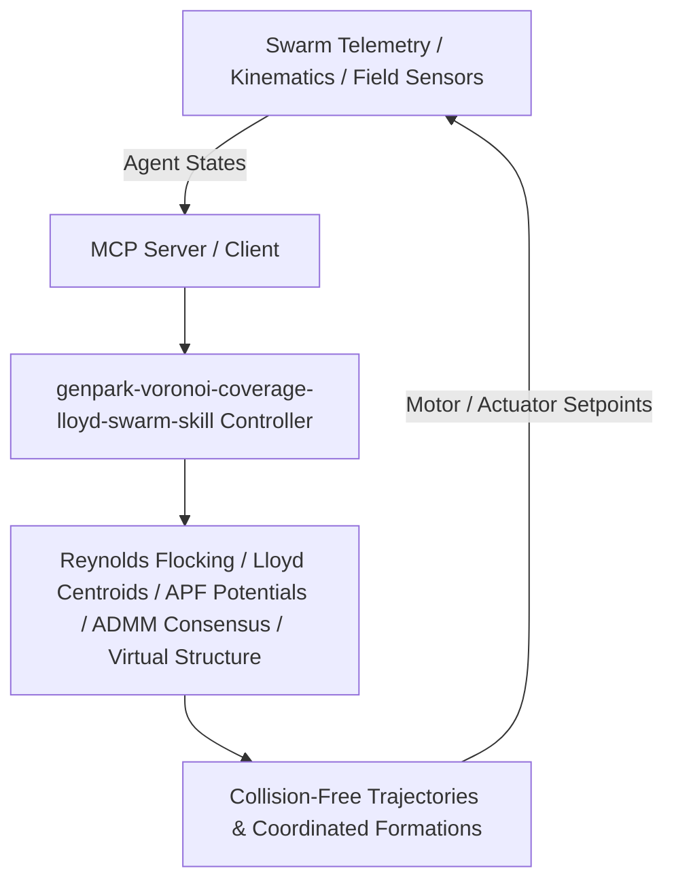

# genpark-voronoi-coverage-lloyd-swarm-skill

[](https://github.com/alphaparkinc/genpark-voronoi-coverage-lloyd-swarm-skill)
[](https://python.org)
[](#)
[](#)
[](LICENSE)

> Distributed Lloyd's algorithm for optimal robotic sensor swarm area coverage and Voronoi partition centroid convergence.

## Architecture Overview



## Features
- **0 External Pip Dependencies**: Pure Python standard library implementation.
- **MCP Protocol Ready**: Includes Model Context Protocol server script (`mcp_server.py`).
- **Production Standard**: Thoroughly tested collision-free navigation, geometric formation keeping, and consensus convergence.

## Quick Start
```bash
python example_usage.py
```
